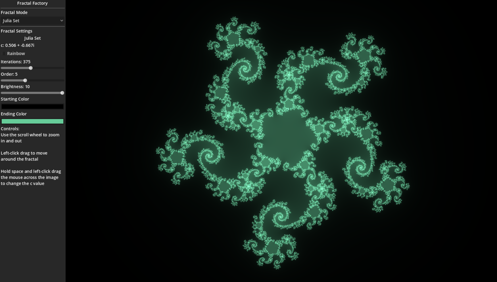
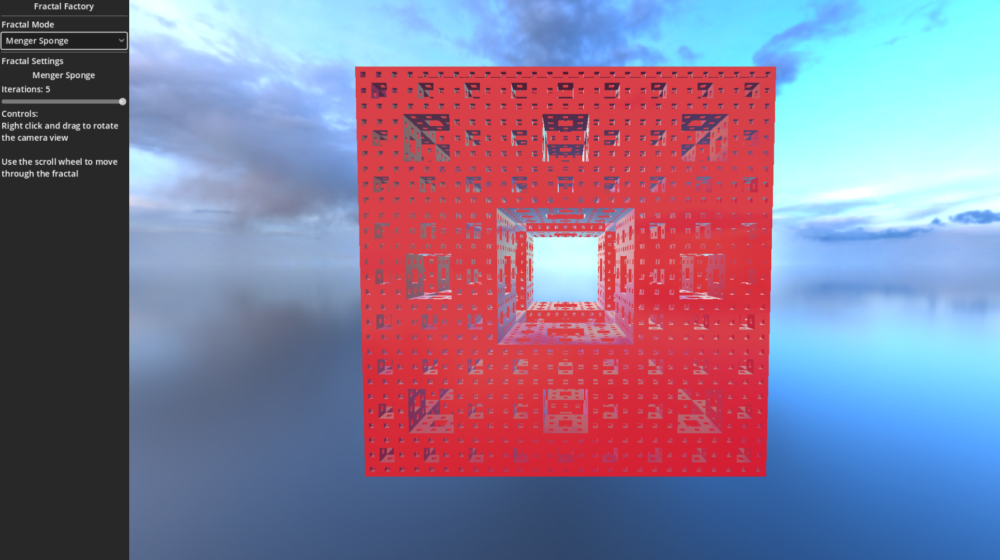

# Fractal Factory

This project was initially created for my high school CS3 class. You can navigate tweak the parameters of multiple different fractals, 2D and 3D alike.

## Gallery

## Fractals Included

### Escape Time Fractals
- Mandelbrot Set
- Julia Set
- Sin Julia
- Spiral Septagon
### 3D Fractals
- Menger Sponge
- Sierpinski Pyramid
### L-system Fractals
- Sierpinski Arrowhead Curve
- Dragon Curve

## Attribution
- [Paul Bourke](https://paulbourke.net/fractals/) for the [Sin Julia](https://paulbourke.net/fractals/sinjulia/) and [Spiral Septagon](https://paulbourke.net/fractals/septagon/)
- [Inigo Quilez](https://iquilezles.org/) for [Smooth Coloring](https://iquilezles.org/articles/msetsmooth/) of the Julia Set and Mandelbrot

## Possible Future Additions
- Ray Marching for Menger Sponge, Mandelbulb, and other 3D fractals
- User defined L-system grammars
- User defined Julia Set equations